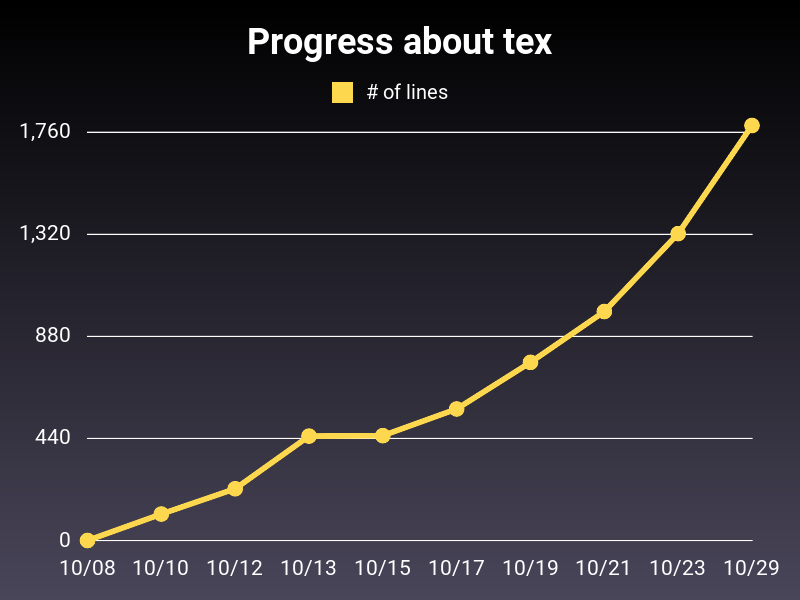

# Progress

## Features
- 作業の進捗を管理して可視化する ~~役に立たない~~ ツールです。

- 拡張子ごとのファイルの全行数および全サイズを保存・プロットすることができます。

## Usage
進捗を記録したいディレクトリにおいて、
初めて`save.rb`を実行すると、`.progress/`という進捗管理用のディレクトリが直下に作成されます。

そして、その中の拡張子ごとに分かれたディレクトリに`lines.csv`と`size.csv`が作成されます。どちらもその時点での日時が一列目の値でして二列目だけが違います。前者は全行数で、後者は全ファイルサイズが記録されます。

進捗を記録した上で`plot.rb`を実行しますと、`lines.csv`および`size.csv`のデータがグラフとして保存されます。横軸が日時、縦軸がそれぞれの値です。
それぞれのグラフは`.progress/<拡張子>/graphs`の中にPNGとして保存されます。

## Example
$\LaTeX$ で文章を作るという作業を行っているディレクトリで上記のように進捗を管理しますと、例えば以下のようなグラフが作成できます、
